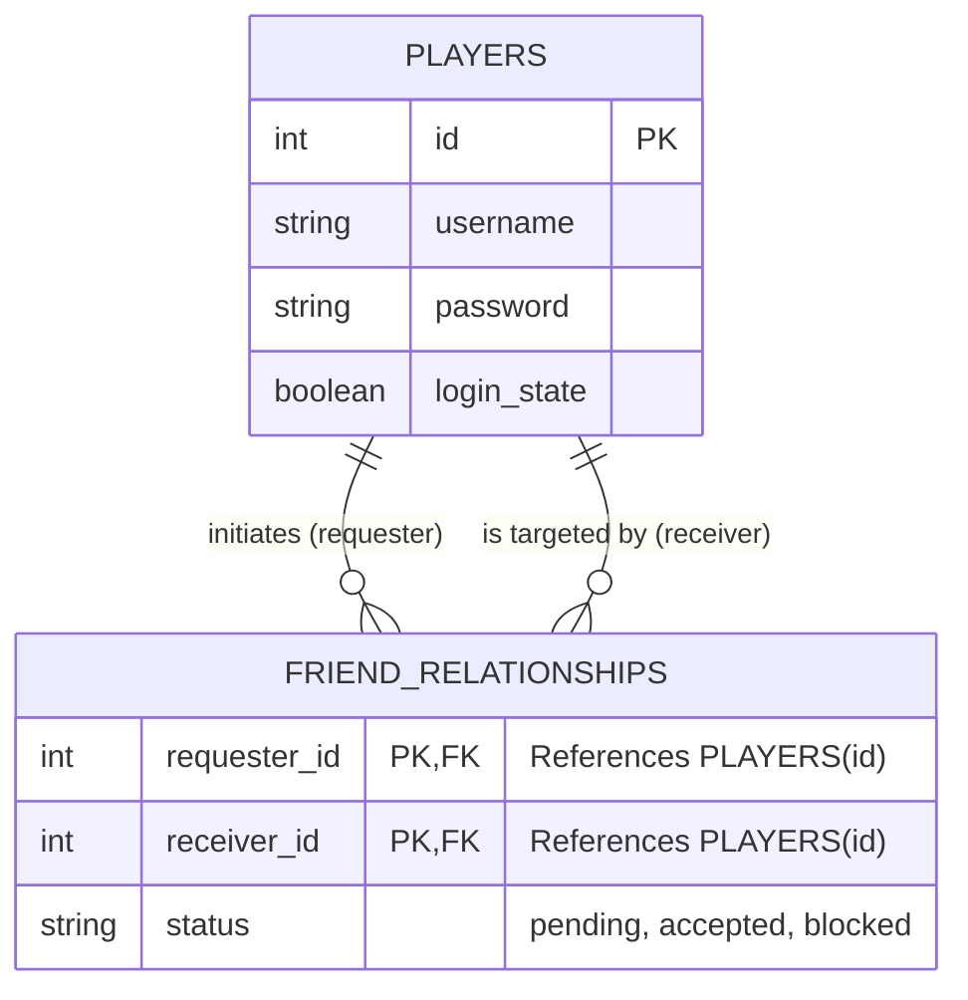

# GameMultiplayerBackend
Backend for multiplayer client/server logic for Turn Based Strategy Card Game.

## Table of Contents
- [Repository Assets](#repository-assets)
  - [App Directory (Active Backend)](./app)
  - [Prototype Directory (Sprint 1 / Early Version)](./prototype)
- [Sprint 1](https://github.com/users/Robebeck/projects/2)
- [App README](https://github.com/Robebeck/GameMultiplayerBackend/blob/main/app/readme.txt)
- [User Stories](#user-stories)
- [Use Cases](#use-cases)
- [Software Requirements](#software-requirements)

## User Stories

As a player I ned to see game invitations so that I can join a lobby.
As a player I need to be able to invite players so that they can join my lobby.
As a player I ned to be able to start a game so that all players in the lobby join a game session.
As a player I need to be able to input game actions that are validated by the server to play the multiplayer game.
As a player I need to be able to receive updates about game state from the server to play the multiplayer game.

## Use Cases

Logging in.
User opens client types, username and password into form.  Server receives these through http request response.  After
authentication user is logged in.  Server shares login state to other users.

Starting Lobby
Logged in user invites other user to lobby.  Invitation is received by server and passed via request response to invited user.
If user accepts they are placed into the same lobby which is a list of players who will join the same game session.

Starting Game
All users within the same lobby, stored as a list on server side join a game session.  At the start of game a websocket session
is started by the user on the client side when they press the start game button in the UI.  The game is loaded after this
websocket handshake is accepted, and at this point client and server interact without http request response needed.

## Repository Assets
- **Use Case Diagram:** [View Diagram](./UseCaseDiagram.jpg) (also available [here](https://github.com/Robebeck/GameMultiplayerBackend/blob/main/UseCaseDiagram.jpg))
- **Entity Relationship Diagram (Legacy):** [View ERD](./erd.png) *(See live updated diagram below!)*
- **App Directory:** [View /app](./app)
- **Prototype Directory:** [View /prototype](./prototype)

## Software Requirements

| ID | Requirement |
|---:|-------------|
| 1 | The system shall support account registration and authentication using a username and password stored in a persistent database. |
| 2 | The system shall allow authenticated clients to create a game lobby and generate a unique lobby identifier. |
| 3 | The system shall allow authenticated clients to join an existing lobby using a valid lobby identifier and shall reject invalid or full lobbies. |
| 4 | The system shall create a game session from a lobby and shall initialize a single authoritative game state on the server for that session. |
| 5 | The system shall accept player commands for a game session and shall validate each command against the current server-authoritative game state. |
| 6 | The system shall update the authoritative game state only when a validated command is accepted and shall record an event describing the state change. |
| 7 | The system shall broadcast accepted events (or updated state snapshots) to all connected clients in the same game session. |
| 8 | The system shall reject and report an error for any command that is invalid, out-of-turn, unauthorized, or inconsistent with the authoritative state, without modifying the authoritative game state. |

## Database Schema (ERD)

